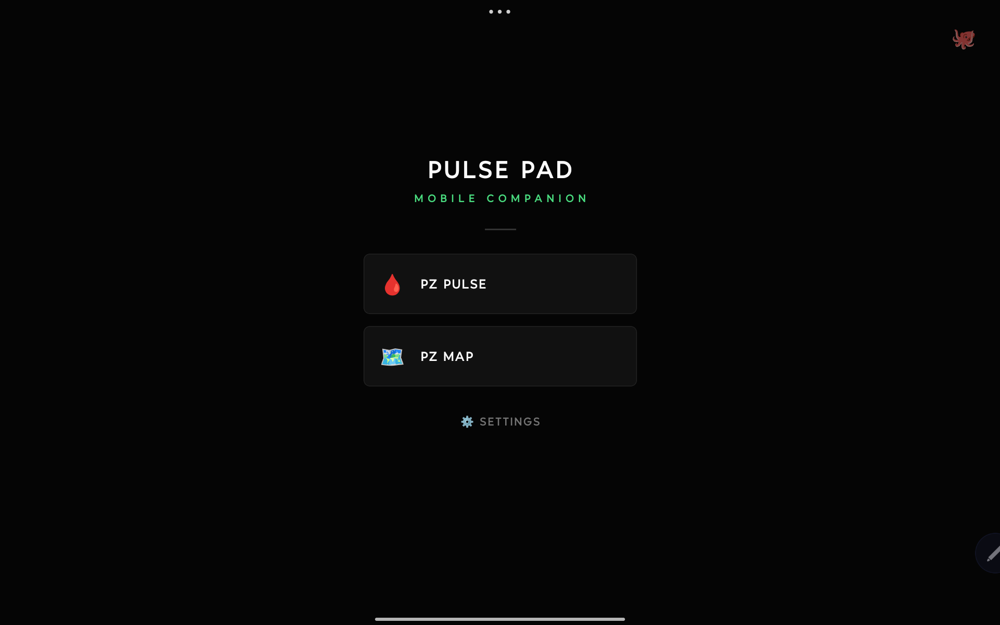
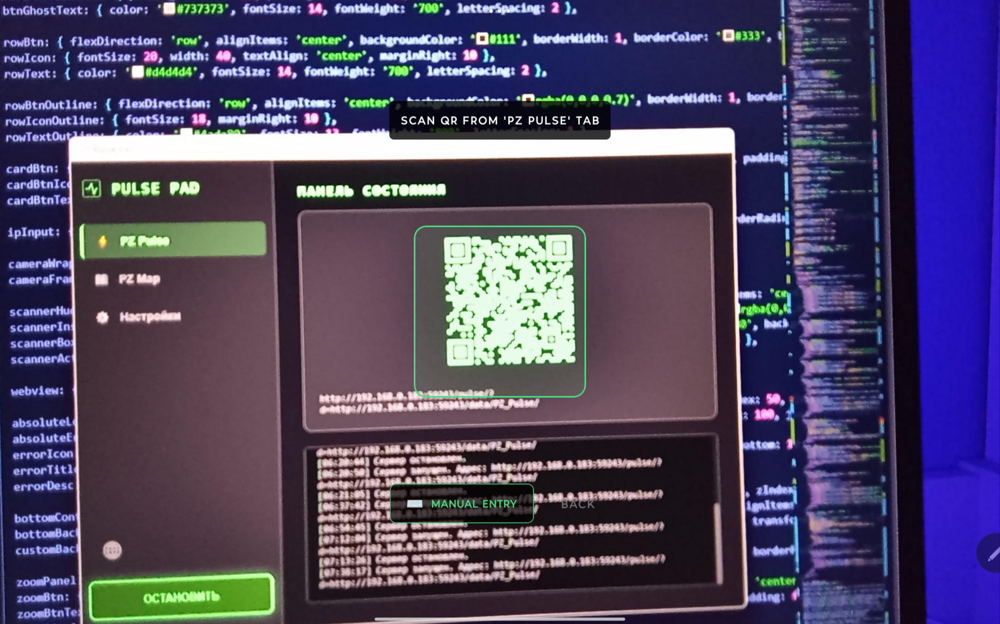

  <h1>📱 Pulse Mobile</h1>
  
<b>The official Android companion app for Pulse Pad. Zero borders, pure tactical UI.</b>

  
  

 

> 🌍 **CHOOSE YOUR LANGUAGE / ОБЕРІТЬ МОВУ / ВЫБЕРИТЕ ЯЗЫК:**
> *Expand the sections below / Розгорніть розділи нижче / Разверните нужный блок*

---

🇬🇧 <b>ENGLISH (Main)</b>

 

A native Android companion app for the **Pulse Pad** desktop server. Built to eliminate browser borders, hide system navigation, and deliver a clean, fullscreen tactical UI for your Project Zomboid survival.

> ⚠️ **Important note:** Pulse Mobile is an add-on, not a standalone app. It strictly requires the main **Pulse Pad** server to be running on your PC. You can get the desktop version 👉 **[here](https://github.com/Vlaseeds/Pulse-Pad)**.
>
> 🍏 **iOS Users:** This native app is designed exclusively for Android. If you use an iPhone or iPad, please use the standard browser method via Safari.

### 👀 Interface Overview

  
  

### 🛠 Features
* 📱 **Absolute Fullscreen:** No address bars, no system buttons. Pure UI.
* 🎛️ **Smart Controls:** A floating, semi-transparent zoom panel that auto-hides to keep your map clear.
* 📷 **Built-in Scanner:** Instantly connect to Pulse and Map modules via QR codes.
* ⌨️ **Manual Entry:** Camera acting up? You can manually type the IP and port.
* 🔋 **Screen Awake:** The app prevents your phone from sleeping while viewing the status tab or map.
* 🔒 **Security:** 100% local traffic within your Wi-Fi network. No external trackers.

### 🚀 Installation & Setup
1. Click the Download link above and grab the latest `.apk` file.
2. Install it on your Android device (allow installation from unknown sources if prompted).
3. Launch **Pulse Pad** on your computer.
4. Follow the on-screen instructions on your phone to scan the QR codes.
   * *Tip: If your camera fails to scan the code, tap the "⌨️ MANUAL ENTRY" button to type the IP address shown in the desktop app directly.*

### ⚖️ Disclaimer & Credits
I am not the author of the original mods. This mobile app and the desktop server were created strictly for Quality of Life (QoL) purposes, merging functionality into a single seamless interface.

All rights to the original modifications belong to their respective creators:
* 🩸 **[PZ Pulse (Status Monitor)](https://steamcommunity.com/workshop/filedetails/?id=3753700423)**
* 🗺️ **[PZ Map (Interactive Map)](https://steamcommunity.com/sharedfiles/filedetails/?id=3770149036)**

---
🐞 *Spotted a bug or have a suggestion? Drop a ticket in the **[Issues](../../issues)** tab.*

🇺🇦 <b>УКРАЇНСЬКА ВЕРСІЯ</b>

 

Нативний Android-додаток для роботи в зв'язці з десктопним сервером **Pulse Pad**. Створений для того, щоб прибрати рамки браузера, сховати системну навігацію і надати гравцеві чистий, повноекранний тактичний інтерфейс для виживання в Project Zomboid.

> ⚠️ **Важлива примітка:** Pulse Mobile — це додаток-компаньйон, а не самостійна програма. Для його роботи обов'язково потрібен запущений сервер **Pulse Pad** на вашому ПК. Завантажити десктопну версію можна 👉 **[тут](https://github.com/Vlaseeds/Pulse-Pad)**.
>
> 🍏 **Користувачам iOS:** Цей нативний додаток створено виключно для Android. Якщо у вас iPhone або iPad, використовуйте стандартний метод гри через браузер Safari.

### 👀 Як це виглядає

  
  

### 🛠 Особливості
* 📱 **Абсолютний Fullscreen:** Жодних адресних рядків та системних кнопок. Чистий UI.
* 🎛️ **Розумні елементи керування:** Плаваюча напівпрозора панель масштабування, яка автоматично зникає.
* 📷 **Вбудований сканер:** Миттєве підключення до модулів Pulse та Map через QR-коди.
* ⌨️ **Ручне введення:** Камера не фокусується? Можна ввести IP та порт вручну.
* 🔋 **Автономність екрану:** Додаток не дає телефону заснути, поки ви перебуваєте у вкладці стану або на мапі.
* 🔒 **Безпека:** 100% локальний трафік у межах вашого Wi-Fi. Жодних трекерів.

### 🚀 Встановлення та Налаштування
1. Натисніть на посилання для завантаження вище та збережіть файл `.apk`.
2. Встановіть його на свій Android-пристрій (дозвольте встановлення з невідомих джерел).
3. Запустіть **Pulse Pad** на комп'ютері.
4. Дотримуйтесь інструкцій на екрані смартфона для сканування QR-кодів.
   * *Порада: Якщо камера не може зчитати код, натисніть кнопку "⌨️ ВВЕСТИ ВРУЧНУ", щоб самостійно прописати IP-адресу з програми на ПК.*

### ⚖️ Дисклеймер та Подяка
Я не є автором оригінальних модів. Цей мобільний додаток та десктопний сервер були створені виключно для покращення якості життя (QoL) гравців.

Усі права на оригінальні модифікації належать їхнім творцям:
* 🩸 **[PZ Pulse (Status Monitor)](https://steamcommunity.com/workshop/filedetails/?id=3753700423)**
* 🗺️ **[PZ Map (Interactive Map)](https://steamcommunity.com/sharedfiles/filedetails/?id=3770149036)**

---
🐞 *Знайшли баг чи є ідея для покращення? Пишіть у розділ **[Issues](../../issues)**.*

🇷🇺 <b>РУССКАЯ ВЕРСИЯ</b>

 

Нативное Android-приложение для работы в связке с десктопным сервером **Pulse Pad**. Создано для того, чтобы убрать рамки браузера, скрыть системную навигацию и дать игроку чистый, полноэкранный тактический интерфейс для выживания в Project Zomboid.

> ⚠️ **Важное примечание:** Pulse Mobile — это приложение-компаньон, а не самостоятельная программа. Для его работы обязательно нужен запущенный сервер **Pulse Pad** на вашем ПК. Скачать десктопную версию можно 👉 **[здесь](https://github.com/Vlaseeds/Pulse-Pad)**.
>
> 🍏 **Пользователям iOS:** Это нативное приложение создано эксклюзивно для Android. Если у вас iPhone или iPad, используйте стандартный метод через браузер Safari.

### 👀 Как это выглядит

  
  

### 🛠 Особенности
* 📱 **Абсолютный Fullscreen:** Никаких адресных строк и системных кнопок. Чистый UI.
* 🎛️ **Смарт-контролы:** Плавающая полупрозрачная панель масштабирования, которая автоматически исчезает.
* 📷 **Встроенный сканер:** Мгновенное подключение к модулям Pulse и Map через QR-коды.
* ⌨️ **Ручной ввод:** Камера мылит картинку? Можно вбить IP-адрес и порт вручную.
* 🔋 **Автономность экрана:** Приложение не дает телефону уснуть, пока вы находитесь во вкладке состояния или на карте.
* 🔒 **Безопасность:** 100% локальный трафик в пределах вашего Wi-Fi. Никаких трекеров.

### 🚀 Установка и Настройка
1. Нажмите на ссылку скачивания выше и сохраните файл `.apk`.
2. Установите на свой Android-смартфон (разрешите установку из неизвестных источников).
3. Запустите **Pulse Pad** на компьютере.
4. Следуйте инструкции на экране смартфона для сканирования QR-кодов.
   * *Совет: Если камера отказывается сканировать код, нажмите кнопку "⌨️ ВВЕСТИ ВРУЧНУЮ", чтобы переписать IP-адрес из программы на ПК.*

### ⚖️ Дисклеймер и Благодарности
Я не являюсь автором оригинальных модов. Это мобильное приложение и десктопный сервер были созданы исключительно для удобства (QoL).

Все права на оригинальные модификации принадлежат их создателям:
* 🩸 **[PZ Pulse (Status Monitor)](https://steamcommunity.com/workshop/filedetails/?id=3753700423)**
* 🗺️ **[PZ Map (Interactive Map)](https://steamcommunity.com/sharedfiles/filedetails/?id=3770149036)**

---
🐞 *Нашли баг или есть идея для улучшения? Смело заводите тикет во вкладке **[Issues](../../issues)**.*

 

  <i>Created with 🧠 by <a href="https://github.com/Vlaseeds">Vlaseeds</a></i>

